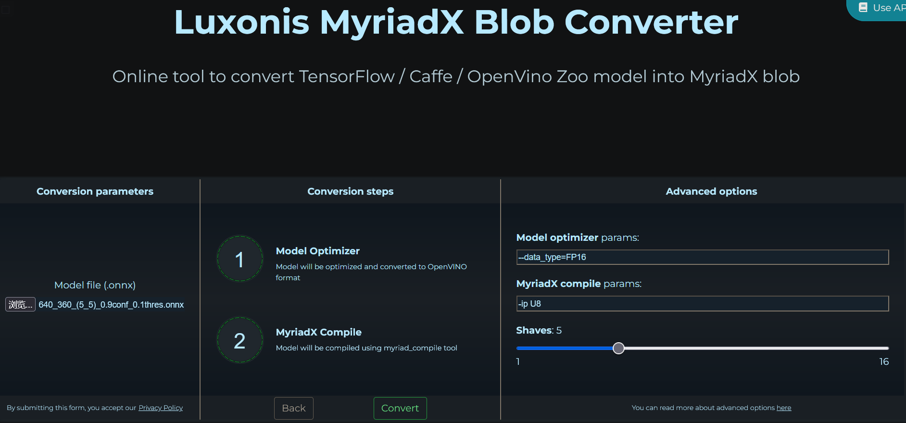

## About the Provided ONNXs
These **.onnx** files are used to generate **.blob** models. The online converter is [here](https://blobconverter.luxonis.com/).
- Use **xxx_xxx_host_side.onnx** for host-side detection blob generation
- Use other **.onnx** files for normal blob generation

You can test and select the best parameters using host-side detection and then apply the normal blob with such parameters.

### Naming Rules
- resolution + grid number on each axis + confidence map threshold + in-grid obstacle pixel number threshold
- example: W_H_(GW_GH)_CONF_THRES

### Converter Parameters
- OpenVINO version: **2021.4**
- model optimizer params: **--data_type=FP16**
- compile params: **-ip U8**
- shaves: usually **5** or **6**, varies with **config.yaml**. If a non-optimal value is used, a warning showing the optimal value will be printed when **main.py** starts.

### Converter Example

